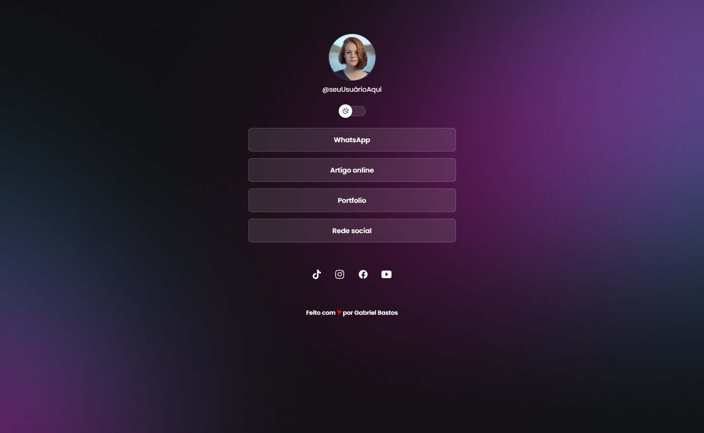

<h1 align="center"> gleicebsouza </h1>

Desenvolvedor(a) front-end jr, no momento estudando para ser uma desenvolvedora FullStack  

  <a href="#-tecnologias">Tecnologias</a>&nbsp;&nbsp;&nbsp;|&nbsp;&nbsp;&nbsp;
  <a href="#-projeto">Projeto</a>&nbsp;&nbsp;&nbsp;

 

  //

## Tecnologias

Esse projeto foi desenvolvido com as seguintes tecnologias:

- HTML e CSS
- JavaScript
- Git e Github

## 💻 Projeto

O DevLinks é um agregador de links para usar como cartão de visitas online.

- [Acesse o projeto finalizado, online](https://gleice.dev/)

---

Feito com ♥ by Gleice Souza:wave:
